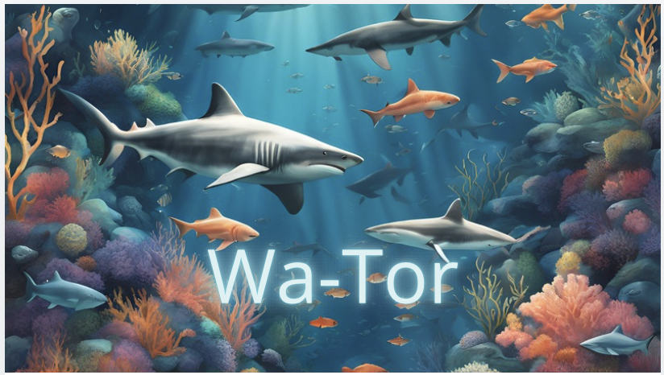
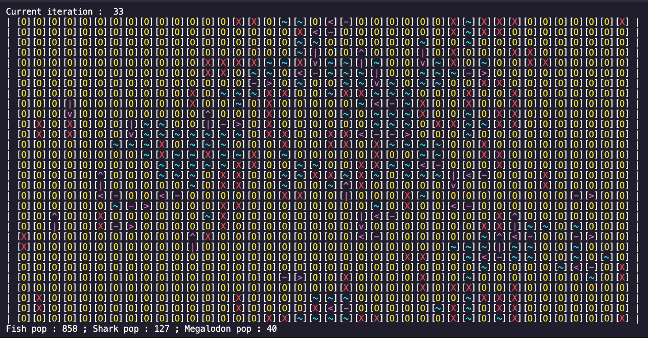

# <p align="center">Simplon_Wa-Tor</p>
<p align="center">
    
</p>

The Wa-Tor Project simulates an aquatic ecosystem, modeling interactions among various marine life, particularly focusing on fish, sharks, and the recently added megalodons. This project demonstrates complex ecosystem dynamics through predator-prey relationships and environmental interactions.

## ➤ Menu

* [➤ Project Structure](#-project-structure)
* [➤ How to run](#-how-to-run)
* [➤ Requirements](#-requirements)
* [➤ Output](#-output)
* [➤ Evaluation Criteria](#-evaluation_criteria)
* [➤ Performances Metrics](#-Performances-metrics)
* [➤ Author](#-authors)

## Project Structure

This project includes the following primary Python files:

- **main.py**: The entry point of the simulation, which initializes the ecosystem and launches the simulation.
- **fish.py**: Contains the `Fish` class for fish behavior and lifecycle. This file also defines the `Shark` class, which manages shark behavior and interactions with other species. Additionally, it implements the `Megalodon` class, representing a more formidable predator that preys on sharks.
- **world.py**: Manages the simulation environment, including aquatic habitats and the positioning of various species.
- **plot.py**: Generates graphical representations of the simulation data using Matplotlib, showing population trends for fish, sharks, and megalodons.
- **WaTorDisplay.py**: Responsible for rendering the simulation, showcasing real-time ecosystem activity.

### watorpygame Module

The **watorpygame** module is used for the graphical interface, enabling real-time visualization and user interaction with the simulation. It includes the following files:

- **DisplayState.py**: Manages the display states within the Pygame interface.
- **PlayScreen.py**: Sets up and controls the main play screen of the Pygame application.
- **PygameWrapper.py**: Wraps Pygame functions to streamline the setup of the graphical interface, enabling real-time observation and interaction with the simulation.
- **UserButton.py**: Defines a customizable button used in the Pygame application.
- **UserImage.py**: Manages images, including functions for resizing images within the application.


## How to Run

To execute the simulation, follow these steps:

1. Ensure Python is installed on your system.
2. Clone this repository to your local machine.
3. Navigate to the project directory.
4. Install the required dependencies:

```bash
pip install -r requirements.txt
```
5. Run the main script to start the simulation:
```bash
python main.py
```

## Outputs

The simulation produces various visual outputs that depict interactions among fish, sharks, and megalodons. Below is an example of the simulation output:


<p align="center">
  
</p>

<p align="center"><i>Overview of the aquatic world with fish and sharks.</i></p>

## Statistics


## Evaluation Criteria

- **Group Project**: Work in teams of three over 11 days (1 day of instruction, 9 project days, and 1 presentation day).

- **Final Presentation**: Present the project to the class on the last day.

- **Grading**: Based on deliverables, code quality, teamwork, and presentation.

**Bonus Objectives**:

1. Implement a graphical interface using Pygame to visualize the simulation.

1. Add new features, such as rocks, a second predator (preying on both fish and sharks), or a day/night cycle.

## Performance Metrics

- **Simulation Accuracy**: Adheres to the rules of the Wa-Tor model.
- **Object-Oriented Programming**:
Appropriate use of classes and inheritance.
Encapsulation of data and behaviors.
- **Code Quality**:
Clear, readable code.
Comprehensive comments and docstrings.
Use of type annotations.
- **Git and GitHub Usage**:
Consistent commit history.
Effective collaboration among team members.
- **Results Display**:
A clear, real-time updating grid.
Relevant information displayed (e.g., current fish, shark counts, current time step).


## Authors

Samuel Thorez 
<a href="https://github.com/SamuelTD" target="_blank">
    
</a>

Nicolas Cassonet 
<a href="https://github.com/NicoCasso" target="_blank">
    
</a>

Khadija Aassi 
<a href="https://github.com/Khadaassi" target="_blank">
    
</a>

