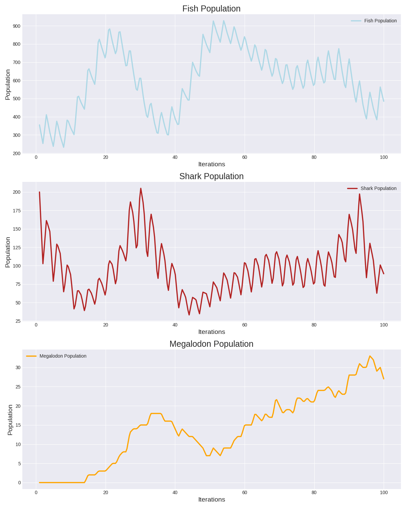

# <p align="center">Simplon_Wa-Tor</p>
<p align="center">
    
</p>

The Wa-Tor Project simulates an aquatic ecosystem, modeling interactions among various marine life, particularly focusing on fish, sharks, and the recently added megalodons and pacman. This project demonstrates complex ecosystem dynamics through predator-prey relationships and environmental interactions.

## ➤ Menu

* [➤ Project Structure](#-project-structure)
* [➤ How to run](#-how-to-run)
* [➤ Requirements](#-requirements)
* [➤ Output](#-output)
* [➤ Evaluation Criteria](#-evaluation_criteria)
* [➤ Performances Metrics](#-performances-metrics)
* [➤ License](#-license)
* [➤ Author](#-authors)

## Project Structure

This project includes the following primary Python files:

- **main.py**: The entry point of the simulation, which initializes the ecosystem and launches the simulation.
- **fish.py**: Contains the `Fish` class for fish behavior and lifecycle. This file also defines the `Shark` class, which manages shark behavior and interactions with other species. Additionally, it implements the `Megalodon` class, representing a more formidable predator that preys on sharks.
- **pacman.py**: Contains the `Pacman`class which inherits from fish and manages Pacman's behavior.
- **storm.py**: Contains the `Storm` class manages the storms behavior.
- **world.py**: Manages the simulation environment, including aquatic habitats and the positioning of various species.
- **stats.py**: Generates graphical representations of the simulation data using Matplotlib, showing population trends for fish, sharks, and megalodons.
- **consoleprint.py**: Contains function to print the output on the terminal.
- **WaTorDisplay.py**: Responsible for rendering the simulation, showcasing real-time ecosystem activity.
_ **configfile.py**: Contains function to manage(write an read) the config.ini file.

### watorpygame Module

The **watorpygame** module is used for the graphical interface, enabling real-time visualization and user interaction with the simulation. It includes the following files:

- **DisplayState.py**: Manages the display states within the Pygame interface.
- **PlayScreen.py**: Sets up and controls the main play screen of the Pygame application.
- **PygameWrapper.py**: Wraps Pygame functions to streamline the setup of the graphical interface, enabling real-time observation and interaction with the simulation.
- **UserButton.py**: Defines a customizable button used in the Pygame application.
- **UserImage.py**: Manages images, including functions for resizing images within the application.
- **WatorColors.py**: Contains a class is used to define the color choices for the WaTor game
- **UserTextBox.py**: Contains a class is a text box that can be used to input text.
- **UserLabel.py**: UserLabel class is used to draw text on the screen
- **UserImageProvider.py**:  That class stores base images and create, resized, rotated, flipped ready to use images.
- **UserImageKey.py**: Enum class for the user image key
- **UserImageInfo.py**:Contains a class is used to store the image key and the direction of the user image
- **IterationIfon.py**:Contains a class is used to store information about the current iteration of the simulation.
- **DisplayCommand.py**:DisplayCommand is an enumeration of the commands that can be sent to the display
- **ConfigScreen.py**:Contains a class is used to display the configuration screen of the Wa-Tor simulation.
- **ConfigFieldUser.py**: Contains a class is used to translate the ConfigField enum into a human readable text


## How to Run

To execute the simulation, follow these steps:

1. Ensure Python is installed on your system.
2. Clone this repository to your local machine.
3. Navigate to the project directory.
4. Install the required dependencies:

```bash
pip install -r requirements.txt
```
5. Run the main script to start the simulation:
```bash
python main.py
```

## Outputs

The simulation produces various visual outputs that depict interactions among fish, sharks, and megalodons. Below is an example of the simulation output:

<p align="center">
  
</p>

<p align="center"><i>Overview of the aquatic world with fish and sharks.</i></p>

## Example of Statistics
The graph below shows the population trends of fish, sharks, and megalodons throughout the simulation.
<p align="center">
  
</p>

## Application pygame

The Pygame application serves as the interactive interface for the Wa-Tor simulation, transforming the underlying ecological model into an engaging visual experience.

**Key Features**:

- *Real-Time Visualization*: The application displays the aquatic ecosystem in motion, allowing users to see fish, sharks, megalodons, and pacman as they navigate through their environment. This real-time graphical representation helps users understand complex predator-prey dynamics.
- *User Interaction*: Users can interact with the simulation by adjusting parameters such as the population densities of different species or introducing new elements into the ecosystem. This interactivity allows for experimentation with different scenarios, enhancing the learning experience.
- *Graphical Representation*: Utilizing Pygame's capabilities, the application presents vibrant, animated graphics that depict the behavior and movements of each species. The visual output is complemented by statistical data shown in real-time, helping users grasp trends and changes within the ecosystem.
- *Customizable Interface*: The Pygame interface includes user-friendly controls and buttons that enable easy navigation through the simulation. Users can start, pause, or reset the simulation, making it accessible for both educational purposes and casual exploration.
- *Engaging Experience*: The visually appealing graphics and interactive features of the Pygame application make learning about ecological systems more enjoyable. Users are immersed in the simulation, fostering a deeper understanding of ecological interactions and the importance of biodiversity.

Through this application, users can appreciate the intricacies of the Wa-Tor model while gaining insights into ecological principles and the impact of various factors on marine life.

<p align="center">
  
</p>

## Evaluation Criteria

- **Group Project**: Work in teams of three over 11 days (1 day of instruction, 9 project days, and 1 presentation day).

- **Final Presentation**: Present the project to the class on the last day.

- **Grading**: Based on deliverables, code quality, teamwork, and presentation.

**Bonus Objectives**:

1. Implement a graphical interface using Pygame to visualize the simulation.

1. Add new features, such as rocks, a second predator (preying on both fish and sharks), or a day/night cycle.

## Performance Metrics

- **Simulation Accuracy**: Adheres to the rules of the Wa-Tor model.
- **Object-Oriented Programming**:
Appropriate use of classes and inheritance.
Encapsulation of data and behaviors.
- **Code Quality**:
Clear, readable code.
Comprehensive comments and docstrings.
Use of type annotations.
- **Git and GitHub Usage**:
Consistent commit history.
Effective collaboration among team members.
- **Results Display**:
A clear, real-time updating grid.
Relevant information displayed (e.g., current fish, shark counts, current time step).

## License

MIT License

Copyright (c) 2024 Samuel Thorez, Nicolas Cassonnet, Khadija Aassi

Permission is hereby granted, free of charge, to any person obtaining a copy
of this software and associated documentation files (the "Software"), to deal
in the Software without restriction, including without limitation the rights
to use, copy, modify, merge, publish, distribute, sublicense, and/or sell
copies of the Software, and to permit persons to whom the Software is
furnished to do so, subject to the following conditions:

The above copyright notice and this permission notice shall be included in all
copies or substantial portions of the Software.

THE SOFTWARE IS PROVIDED "AS IS", WITHOUT WARRANTY OF ANY KIND, EXPRESS OR
IMPLIED, INCLUDING BUT NOT LIMITED TO THE WARRANTIES OF MERCHANTABILITY,
FITNESS FOR A PARTICULAR PURPOSE AND NONINFRINGEMENT. IN NO EVENT SHALL THE
AUTHORS OR COPYRIGHT HOLDERS BE LIABLE FOR ANY CLAIM, DAMAGES OR OTHER
LIABILITY, WHETHER IN AN ACTION OF CONTRACT, TORT OR OTHERWISE, ARISING FROM,
OUT OF OR IN CONNECTION WITH THE SOFTWARE OR THE USE OR OTHER DEALINGS IN THE
SOFTWARE.

## Authors

Samuel Thorez 
<a href="https://github.com/SamuelTD" target="_blank">
    
</a>

Nicolas Cassonnet 
<a href="https://github.com/NicoCasso" target="_blank">
    
</a>

Khadija Aassi 
<a href="https://github.com/Khadaassi" target="_blank">
    
</a>


## Acknowledgment

